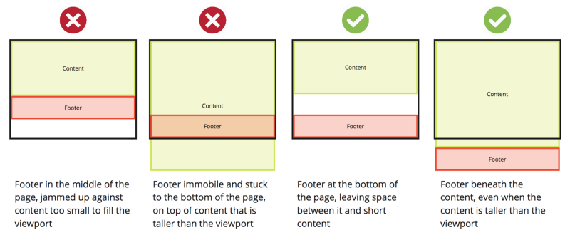

## 要求

- 当页面内容不够填充屏幕的时候，footer 显示在屏幕末尾；
- 当页面内容超出屏幕的时候，当页面滑到底时，footer 显示，位置也在屏幕末尾；

## 思路

- 在 content 和 footer 外创建一个 container，footer 放在 container 末尾；
- 当内容不够填充 viewport 的高度的时候，将 container 的高度设置为 viewport 的 100%，从而 footer 处于 container 的底部的同时，也处于 viewport 的底部；
- content 下面设置 padding，以免和 footer 重叠。

## 代码

  See the Pen <a href="https://codepen.io/jasonzhouu/pen/xxbVJEe">
  footer in bottom</a> by Jason Zhou (<a href="https://codepen.io/jasonzhouu">@jasonzhouu</a>)
  on <a href="https://codepen.io">CodePen</a>.

## 解释

- `#footer`设置`position: absolute;  bottom: 0px;`表示，它脱离flow，并将位置放在 ancestor 的末尾。并且`#page-container`也要设置`position: relative;`。

> `position: absolute` means something like "use `top`, `right`, `bottom`, `left` to position yourself in relation to the nearest ancestor who has `position: absolute` or `position: relative`."
>
> [https://stackoverflow.com/a/10487329/7218912](https://stackoverflow.com/a/10487329/7218912)

- 设置`position: absolute;`后还得设置`width: 100%;`，否则无法占据屏幕宽度。

- 如果`#page-container`不设置 `min-height: 100vh;`，那么当内容不够填充 viewport 时，footer 将处于 viewport 中间：

- `#content-wrap`设置 `padding-bottom: 2rem; `，与 `#footer`的 height 高度刚好吻合，从而不互相覆盖。否则，由于`#footer`脱离 flow，当 `#content-wrap` 足够填充整个 viewport 时，`#content-wrap` 的底部将与 `#footer` 重叠。

---
## 参考
1. 代码参考 [https://www.freecodecamp.org/news/how-to-keep-your-footer-where-it-belongs-59c6aa05c59c/](https://www.freecodecamp.org/news/how-to-keep-your-footer-where-it-belongs-59c6aa05c59c/)
2. position: absolute 的解释 [https://stackoverflow.com/a/10487329/7218912](https://stackoverflow.com/a/10487329/7218912)
